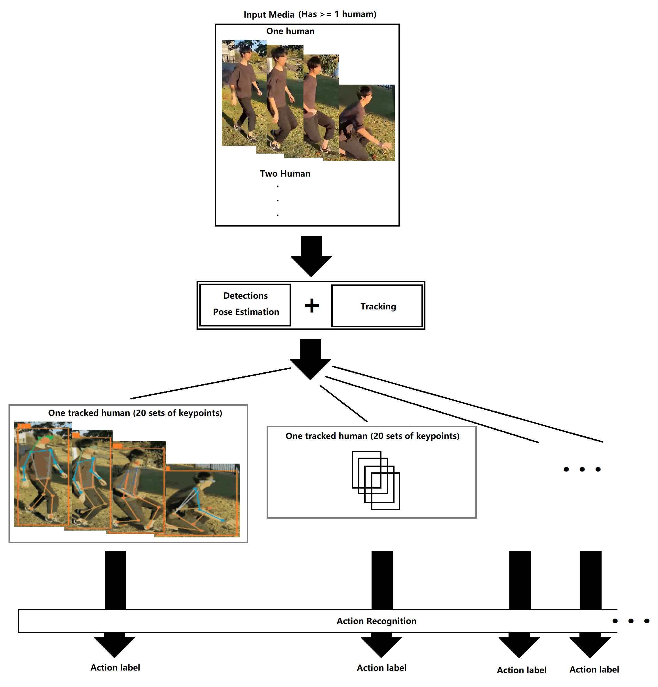

<h1 align="center">Unified Action Recognition System</h1>

Presenting a highly adaptable unified Action Recognition System.

The goal is to enable users to easily customize the system to suit their applications.

This system can be fine-tuned to recognize as many actions as needed, by just providing a few videos for each action. The resulting fine-tuned model is capable of real-time action recognition with a webcam.

<h2 align="center">Demo</h2>
<p align="center">
Fall Detection

Ball Kicking Analysis

Aircraft Marshaller Signals

</p>

<h2 align="center">Setup Environment for Demo</h2>
<p align="left">

The code requires `python>=3.8`, as well as `pytorch>=1.7` and `torchvision>=0.8`. Please follow the instructions [here](https://pytorch.org/get-started/locally/) to install both PyTorch and TorchVision dependencies. Installing both PyTorch and TorchVision with CUDA support is strongly recommended.
</p>

<h3 align="center">Clone the repository locally</h3>

```
git clone https://github.com/kaikaic1998/Unified_Action_Recognition_System.git
cd Unified_Action_Recognition_System
```
<h3 align="center">Installation</h3>

**Step 1.** Install libraries
```
pip install -r requirements.txt
```

**Step 2.** Install Cython_bbox
```
pip install -e git+https://github.com/samson-wang/cython_bbox.git#egg=cython-bbox
```
**Step 3.** Install lap
```
pip install lap
```
If above is not successful, try below:
```
git clone https://github.com/gatagat/lap.git
cd lap
python setup.py build
python setup.py install
cd ../
```

<h3 align="center">Pre-trained Model Checkoints</h3>
<p align="left">

Download [YOLOv7 Pose](https://github.com/WongKinYiu/yolov7/releases/download/v0.1/yolov7-w6-person.pt) pre-trained models and put them in 'pretrained' folder

<h3 align="center">Demo</h3>

A sample video is provided in video/fall.mp4 for demo.

Provided model is pretrained for Human Fall Detection.

```
python demo.py
```

<h3 align="center">Fine-tune</h3>

You can try fine-tune the model to recognize your custom action.

**Data Preparation**

Supported media format
```
image formats: bmp, jpg, jpeg, png, tif, tiff, dng, webp, mpo
video formats: mov, avi, mp4, mpg, mpeg, m4v, wmv, mkv
```
Put your videos in `dataset/` following below folder structures:
```
├── dataset
│   ├── train
│   │   ├──  class1
│   │   │   ├──  video1.mp4
│   │   │   ├──  video2.mp4
│   │   │   .
│   │   │   .
│   │   │   .
│   │   ├──  other classes
│   │   .
│   │   .
│   │   .
│   ├── val
│   │   ├──  class1
│   │   │   ├──  video1.mp4
│   │   │   ├──  video2.mp4
│   │   │   .
│   │   │   .
│   │   │   .
│   │   ├──  other classes
│   │   .
│   │   .
│   │   .
```
**Start fine-tuning**

The newly fine-tuned model can automatically identfy the number of actions to be recognized base on the number of class folders provided.
```
python train.py --save-model True
```

<h2 align="center">More about the Unified Action Recognition System</h2>

<h3 align="center">System Backbone</h3>
<p align="center">

| Description | Model |
|:---|:---:|
| Detection & Pose Estimation | YOLOv7 Pose |
| Tracking | BoT-SORT |
| Skeleton Action Recognition | STGCN++ |
<p>

<h3 align="center">System Architecture</h3>

Input media is first input into the first layer where the system detect, track all human in a frame and produce a set of keypoints for each of them.

As long as each set is filled with 20 keypoints, then is fed into the Action Recognition layer to predict an action label for each set of keypoints, hence, a label for a tracked human. This oepration is realized by using sliding window method, enabling real-time action recognition.
<p align="center">

</p>

<h3 align="center">Experiment on Learning Rate</h3>

The most suitable learning rate is discovered and provided as default value for users to easily fine-tune the model without the concern of underperforming training process.

During the experiment, various learning rate values are trialed in training and the experiment is performed multiple times. 

Below is one of the trials, showing multiple learning rate candidates. The learning rate of 0.01 is found to have the best outcome.

<p align="center">

</p>

<h2 align="center">Citation</h2>

```
@article{aharon2022bot,
  title={BoT-SORT: Robust Associations Multi-Pedestrian Tracking},
  author={Aharon, Nir and Orfaig, Roy and Bobrovsky, Ben-Zion},
  journal={arXiv preprint arXiv:2206.14651},
  year={2022}
}
```
```
@article{wang2022yolov7,
  title={{YOLOv7}: Trainable bag-of-freebies sets new state-of-the-art for real-time object detectors},
  author={Wang, Chien-Yao and Bochkovskiy, Alexey and Liao, Hong-Yuan Mark},
  journal={arXiv preprint arXiv:2207.02696},
  year={2022}
}
```
```
@inproceedings{duan2022pyskl,
  title={Pyskl: Towards good practices for skeleton action recognition},
  author={Duan, Haodong and Wang, Jiaqi and Chen, Kai and Lin, Dahua},
  booktitle={Proceedings of the 30th ACM International Conference on Multimedia},
  pages={7351--7354},
  year={2022}
}
```